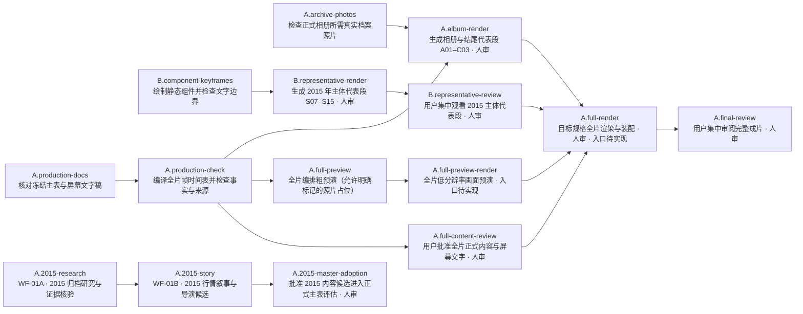

# OPS-001.1 · 当前任务 DAG

从实际任务注册表生成。

```mermaid
flowchart LR
  n0["A.production-docs<br/>核对冻结主表与屏幕文字稿"]
  n1["A.archive-photos<br/>检查正式相册所需真实档案照片"]
  n2["B.component-keyframes<br/>绘制静态组件并检查文字边界"]
  n3["A.2015-research<br/>WF-01A · 2015 归档研究与证据核验"]
  n4["A.production-check<br/>编译全片帧时间表并检查事实与来源"]
  n5["B.representative-render<br/>生成 2015 年主体代表段 S07–S15 · 人审"]
  n6["A.2015-story<br/>WF-01B · 2015 行情叙事与导演候选"]
  n7["A.album-render<br/>生成相册与结尾代表段 A01–C03 · 人审"]
  n8["A.full-preview<br/>全片编排粗预演（允许明确标记的照片占位）"]
  n9["A.full-content-review<br/>用户批准全片正式内容与屏幕文字 · 人审"]
  n10["B.representative-review<br/>用户集中观看 2015 主体代表段 · 人审"]
  n11["A.2015-master-adoption<br/>批准 2015 内容候选进入正式主表评估 · 人审"]
  n12["A.full-preview-render<br/>全片低分辨率画面预演 · 入口待实现"]
  n13["A.full-render<br/>目标规格全片渲染与装配 · 人审 · 入口待实现"]
  n14["A.final-review<br/>用户集中审阅完整成片 · 人审"]
  n0 --> n4
  n2 --> n5
  n3 --> n6
  n1 --> n7
  n4 --> n7
  n4 --> n8
  n4 --> n9
  n5 --> n10
  n6 --> n11
  n8 --> n12
  n12 --> n13
  n7 --> n13
  n10 --> n13
  n9 --> n13
  n13 --> n14
```
